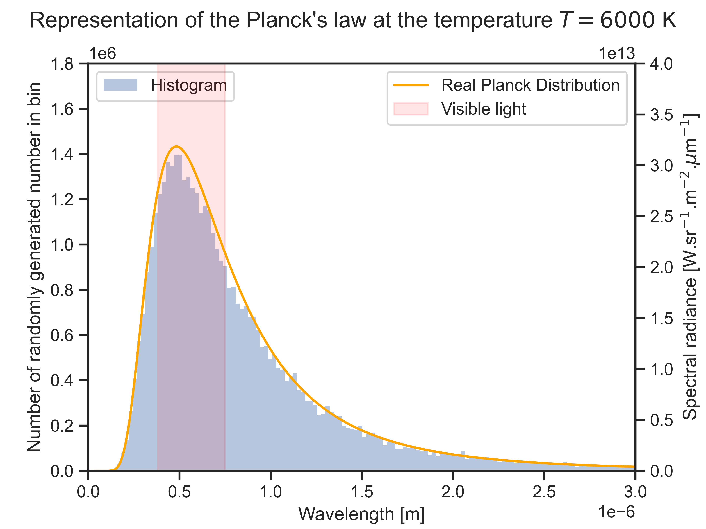

# Why this project ?

This *Monte Carlo Radiative Transfer in Astrophysics* project was a **collaborative** project made for the Computer Programming class of the second semester of Strasbourg's Master of Fundamental Physics (M1S2).

The collaboration was done in-between Davy Borowski, Quentin Fenoy, Yulia Fok, Pierre Galois, Guillaume Harmant and I (Pierre Guichard).


## Installation
Open the terminal and go to the main folder.
First you need to setup a virtuel environment, to do so, make sure you already have the `virtuelenv` module,
```bash
pip install virtualenv
```
Once installation is complete, the virtual environment can be created by typing `virtuelenv -p /usr/bin/python3 env`. This command line will create, in the current directory, an environment named `env`, and store it in a folder of the same name. The environment env can be loaded via `source env/bin/activate`. At this point, the name of your environment should have appeared in your prompt as a prefix. Now, we just need  to install the needed modules on our new environement `env`. The following command will install the packages according to the configuration file
```bash
pip install -r requirements.txt
```
After all of that, we are good to go.
## Usage

In order to run the code, you can simply run this command where the file is located
```bash
python3 main.py
```
After doing so, you are asked to enter either a processus or a check to execute, the implemented ones are the following,


- Processus
    - Radio
    - Exoplanet detection
    - Obstacle
- Checks
    - 3D plot
    - Planck sampling

Note that some of the codes are long to run because of the high number of photons needed to ensure some viewable results.


These are the images generated by the checks (`3D plot` on the left, `Planck sampling` on the right),




And thoses generated by the process (`Obstacle` on the left, `Radio` on the right),


## License

<center>
